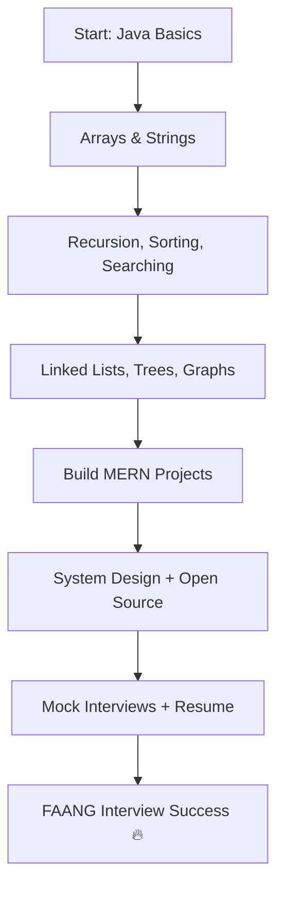

<!-- Arjun Sorout - FAANG-Ready GitHub Profile README -->

<p align="center">
  
</p>

<h1 align="center">Hey there 👋, I'm <span style="color:#fca311;">Arjun Sorout</span></h1>
<h3 align="center">🚀 Full Stack Developer | FAANG Aspirant | DSA Grindset | Passionate Problem Solver</h3>

<p align="center">
  
</p>

---

### 🧠 About Me

```yaml
name: Arjun Sorout
based_in: India
education: B.Tech in Computer Science @ GLA University
currently_learning:
  - Advanced DSA (Striver + GFG)
  - Full Stack Development (MERN)
  - System Design
goal: Crack Google / Microsoft / Amazon (FAANG)
mindset: 100 Days of Code | Consistency > Motivation
```

---

### ⚙️ My Tech Stack

<p align="center">
  
</p>

---

### 📊 My GitHub Stats

<p align="center">
  
  
  <br/>
  
</p>

---

### 🌱 My Learning Journey



---

### 🔥 Contribution Graph

<p align="center">
  
</p>

---

### 🤝 Let's Connect

<p align="center">
  <a href="https://linkedin.com/in/arjun-sorout-9aa10a290">
    
  </a>
  <a href="https://github.com/Arjun-coder5">
    
  </a>
</p>

---

### 💡 Quote I Live By

> “Success is no accident. It is hard work, perseverance, learning, studying, sacrifice and most of all, love of what you are doing.”

<p align="center">
  
</p>

---

<!-- End of README -->
