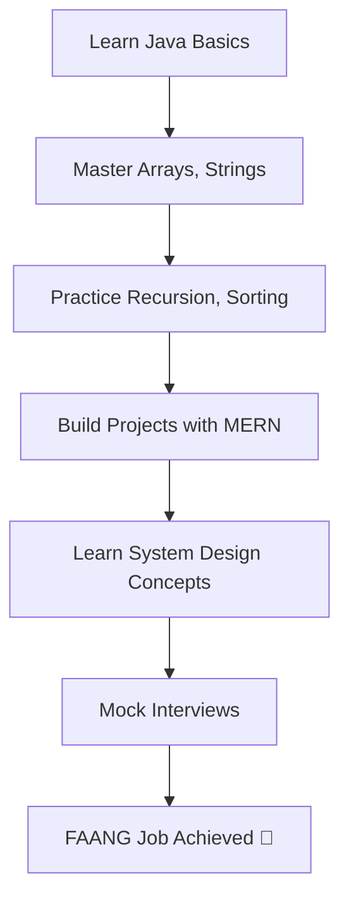

<!-- Arjun Sorout - FAANG-Ready GitHub Profile README -->

<p align="center">
  
</p>

<h1 align="center">Hi 👋, I'm Arjun Sorout</h1>
<h3 align="center">🚀 Full Stack Developer | FAANG Aspirant | DSA Grindset</h3>

<p align="center">
  
</p>

---

### 🧠 About Me

```yaml
name: Arjun Sorout
location: India
college: GLA University (B.Tech CSE)
current_focus:
  - DSA (Striver A2Z + GFG A-Z)
  - MERN Stack Development
  - Open Source Projects
goal: Crack FAANG (Google / Microsoft / Amazon)
```
---

### 🧰 Tech Stack (Animated Icons)

<p align="center">
  
</p>

---

### 📊 GitHub Stats (Auto-Updating)

<p align="center">
  
  
  <br/>
  
</p>

---

### 📈 Contribution Graph (Animated Heatmap)

<p align="center">
  
</p>

---

### 🧩 My Learning Path



---

### 🔗 Let’s Connect

<p align="center">
  <a href="https://linkedin.com/in/arjun-sorout-9aa10a290">
    
  </a>
  <a href="https://github.com/Arjun-coder5">
    
  </a>
</p>

---

### 💬 Quote I Live By

> “Grind in silence. Let your GitHub speak volumes.”

<p align="center">
  
</p>

---

<!-- End of README -->
